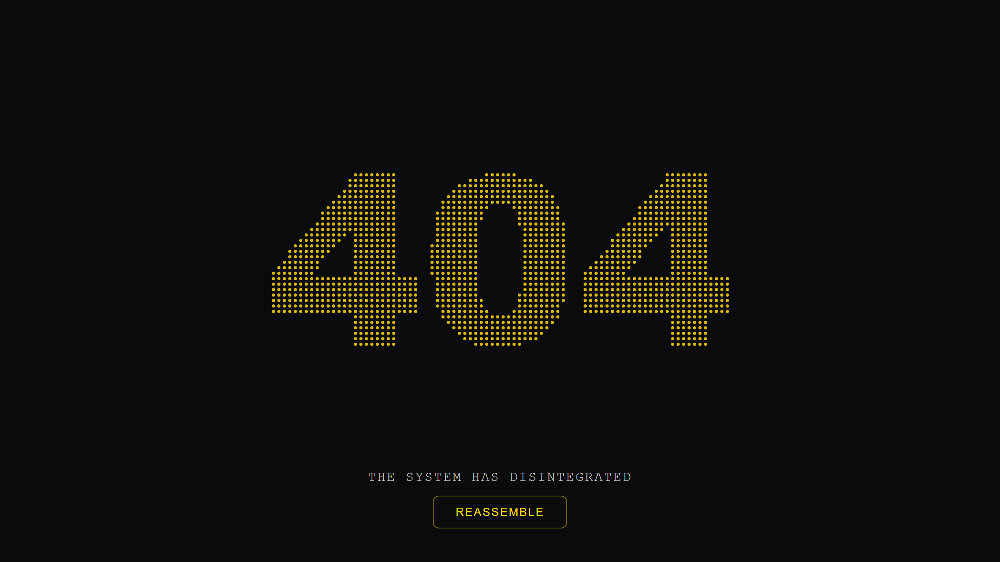

<div align="center">
  
  
  
  
  

  <h1><a href="https://viratiakiranandhanreddy.github.io/404-particle-pro">404-particle-pro</a></h1>
  <p><em>Interactive particle-based 404 page where errors disintegrate and reassemble.</em></p>
</div>

---

## **📎 Why 404-particle-pro?**

**404-particle-pro** is a **canvas-powered, generative-art 404 error page** that transforms the classic “Page Not Found” into an immersive experience.

Instead of static text, the `404` is built from **hundreds of particles** that:

* 🐝 React to mouse & touch movement
* 🧲 Disintegrate on interaction
* 🔁 Smoothly reassemble into the original shape
* ⚡ Run entirely on **Vanilla JavaScript**

Designed for **developers who care about details**, motion, and polish.

---

## **📸 Preview**

### **Desktop View**



### **Mobile View**

.png)
---

## **✨ Features**

### **1. Particle Typography Engine**

* Text rendered via `<canvas>`
* Pixel-scanned glyph generation
* Each pixel becomes an independent particle
* Base-position locking preserves glyph accuracy

### **2. Interactive Physics**

* Mouse & touch repulsion
* Density-based force calculation
* Maximum offset clamping (prevents shape distortion)
* Smooth easing back to origin

### **3. High-DPI & Responsive Rendering**

* Device Pixel Ratio (DPR) aware
* Retina-sharp visuals
* Scales dynamically with viewport size
* Debounced resize recalculation

### **4. Minimal UI Layer**

* Floating system-style message
* Accessible reassemble button
* Keyboard support:

  * `Enter` / `Space` → Reassemble
  * `Escape` → Exit error state

### **5. Zero Dependencies**

* No libraries
* No frameworks
* No assets
* Single HTML file

---

## **🚀 Live Demo**

<kbd>**[/404-particle-pro/](https://viratiakiranandhanreddy.github.io/404-particle-pro)**</kbd>

---

## **🛠️ Installation & Setup**

### **1. Clone the Repository**

```bash
git clone https://github.com/ViratiAkiraNandhanReddy/404-particle-pro.git
```

### **2. Use as GitHub Pages 404**

Rename the file:

```text
index.html → 404.html
```

Push it to the **root of your GitHub Pages repository**.

GitHub Pages automatically serves `404.html` for all invalid routes.

---

## **🧩 Customization**

### **🔹 Change Displayed Text**

```js
ctx.fillText('404', adjustX, adjustY);
```

Replace with any short word (e.g. `"ERROR"`, `"LOST"`).

---

### **🔹 Particle Density**

```js
const densityCSS = 7;
```

Lower = fewer particles, higher = denser glyph.

---

### **🔹 Interaction Radius**

```js
const mouse = { radius: 120 };
```

Controls how far particles react to input.

---

### **🔹 Colors & Theme**

```css
:root {
  --bg: #0b0b0b;
  --gold: 255, 215, 0;
}
```

---

## **♿ Accessibility**

* Canvas marked `aria-hidden="true"`
* Semantic button element
* ARIA labels for screen readers
* Keyboard-only navigation support
* Focus-visible outlines

---

## **🧪 Browser Support**

* Chrome
* Edge
* Firefox
* Safari
* Mobile browsers

(Requires Canvas + ES6 support)

---

## **🤝 Contributing**

Contributions are welcome:

1. Fork the repository
2. Create a new branch
3. Commit your changes
4. Open a Pull Request

---

## ⭐ Support

<kbd>If you like this project, consider giving it a star ⭐ — it helps a lot.</kbd>

---

## 📝 License

<p align="center"><kbd>&copy; 2025 <a href="https://github.com/ViratiAkiraNandhanReddy">ViratiAkiraNandhanReddy</a>. This project is licensed under the <i>MIT License</i>.</kbd></p>

---

## 👤 Author

### Developed by [ViratiAkiraNandhanReddy](https://github.com/ViratiAkiraNandhanReddy)

> 💤 - PASSIVE MAINTENANCE : Mean the project is no longer actively developed ***( NO New Features And Regular Updates )***, but the maintainer will respond only when an issue or PR is raised. Feel free to fork and continue development!

---

<h3 align="center"> 🌟 Questions, suggestions, or want to contribute? Open an issue or pull request on GitHub! 🌟 </h3>

<p align="center">  </p>
